# Quera_G11-Project3
Deep Learning (Image Classification & Sentiment Analysis)

This repository is for the third internship project of [Quera Data Science Bootcamp](https://quera.org/college/bootcamp/data-science)

[Quera](https://quera.org/) Data Science Bootcamp has been held for 12 weeks from August to November 2023. in which we learned and practiced both technical and soft skills in order to become ready to work as data Scientists in the market and industry.

This repository is for the third teamwork internship project of this Bootcamp, which is about Image Classification and Sentiment Analysis in Deep Learning and Natural Language Processing.

The following members are present in this team, arranged in alphabetical order:
- (Group 11)
* [**Mr. Abednezhad, Saleh (Team Head)**](https://github.com/mr-robot77)
* [Mr. Ghiyasi, Mahdi](https://github.com/mahdi-ghiyasi)
* [Mr. Moosaei, Amirali](https://github.com/mo0o0o0os)

This team has completed the project under the mentoring of **Mr. Jour Ebrahimian, Hossein**.

--------------------------------------------------------------------------------------------------
##  Introduction

Welcome to the documentation for our project that involves importing data into Jupyter Notebook, performing  and  analysis on the collected data with , and finally visualizing it. This project aims to provide valuable insights into data, enabling us to make informed decisions and gain a deeper understanding of .

## Objectives

The primary objective of this project is to create a  data. By following this documentation, you will learn how to:

1. Image Classification: analyzing data with  and getting insights.

2. Sentiment Analysis : analyzing data with .

3. : .


Below is a file structure of this project:

```
    .
    ├── Problem1-Image Classification    # Image Classification
    |    ├── image_product_classification.ipynb
    |
    ├── Problem2-Sentiment Analysis-NLP  # Sentiment Analysis
    |   ├── Sentiment_Analysis_Amazon_NLP_Q1.ipynb
    |   ├── Sentiment_Analysis_Amazon_NLP_Q2.ipynb
    |   ├── Sentiment_Analysis_Amazon_NLP_Q3.ipynb
    |   ├── Sentiment_Analysis_Amazon_NLP_Q4.ipynb
    |
    ├── images
    |
    ├── submission
    |
    ├── ERD_diagram.png   # Picture of ERD Diagram Schema
    |
    └── README.md # Explanation of project structure, tools used, and instructions for executing each part of the project.
```


--------------------------------------------------------------------------------------------------
# Problem 1: Image Classification

### Problem 1: Image Classification
#### Load Data
* Create DataFrame for **Train Data**
    | image_dir                                           | label |
    |-----------------------------------------------------|-------|
    | /kaggle/input/image-prooduct-quera/train_data/...   | 7     |
    | /kaggle/input/image-prooduct-quera/train_data/...   | 7     |
    | /kaggle/input/image-prooduct-quera/train_data/...   | 7     |
    | /kaggle/input/image-prooduct-quera/train_data/...   | 7     |
    | /kaggle/input/image-prooduct-quera/train_data/...   | 7     |

* Create DataFrame for **Test Data**
    | image_dir                                           |
    |-----------------------------------------------------|
    | /kaggle/input/image-prooduct-quera/test_data/t...   |
    | /kaggle/input/image-prooduct-quera/test_data/t...   |
    | /kaggle/input/image-prooduct-quera/test_data/t...   |
    | /kaggle/input/image-prooduct-quera/test_data/t...   |
    | /kaggle/input/image-prooduct-quera/test_data/t...   |

* Check Number of Samples in each Class
    * 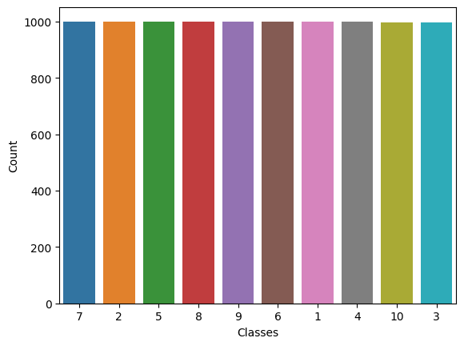

* Plot some Images in each Class
    * 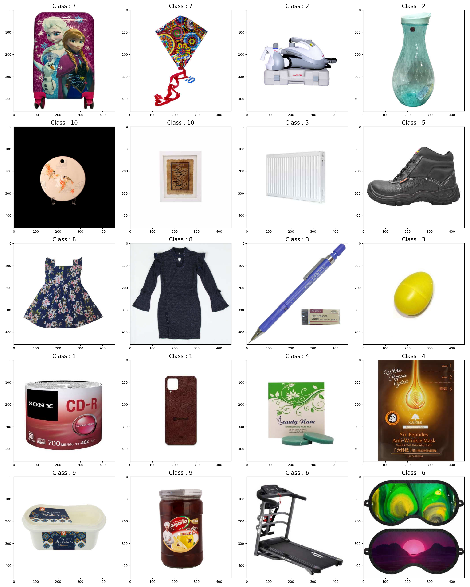

#### Define Functions
##### Function for Create Generators of Train | Validation | Test
##### Function for Data Augmentation on each Bach
##### Function for Create pretrained Model as Base Model
##### Function for Add our Layeres to Base Model
##### Functions for Evaluation Metrics
##### Functions for Save and Load Models

#### Try Models
* ResNet 50
    * ResNet 50 | Train  0 Layers |           -           | LR = 1e-3
    * ResNet 50 | Train  0 Layers | 2 Dense Layer 128     | LR = 1e-3
    * ResNet 50 | Train  5 Layers | 2 Dense Layer 128     | LR = 1e-3
    * ResNet 50 | Train 10 layers | 2 Dense Layer 256,128 | LR = 1e-3
    * ResNet 50 | Train 15 layers | 2 Dense Layer 256,128 | LR = 1e-3
    * ResNet 50 | Train 20 layers | 2 Dense Layer 256,128 | LR = 1e-4
    * ResNet 50 | Train 25 layers | 2 Dense Layer 256,128 | LR = 1e-4
    * ResNet 50 | Train 45 layers | 2 Dense Layer 256,128 | LR = 1e-4
      
* Xception
    * Xception | Train 20 layers | 2 Dense Layer 128,64  | LR = 1e-5
    * Xception | Train 20 layers | 2 Dense Layer 128,64  | LR = 5e-5
    * Xception | Train 20 layers | 2 Dense Layer 128,64  | LR = 1e-4
    * Xception | Train 20 layers | 2 Dense Layer 256,128 | LR = 1e-5
    * Xception | Train 20 layers | 2 Dense Layer 256,128 | LR = 5e-5
    * Xception | Train 20 layers | 2 Dense Layer 256,128 | LR = 1e-4  --->
      
* EfficientNet V2 M
    * EfficientNet | Train 20 layers | 2 Dense Layer 128,64 | LR = 1e-3
    * EfficientNet | Train 20 layers | 2 Dense Layer 128,64 | LR = 5e-4
    * EfficientNet | Train 20 layers | 2 Dense Layer 128,64 | LR = 1e-4
    * EfficientNet | Train 20 layers | 2 Dense Layer 128,64 | LR = 1e-4 | L2
    * EfficientNet | Train 20 layers | 2 Dense Layer 256,128 | LR = 1e-3
    * EfficientNet | Train 20 layers | 2 Dense Layer 256,128 | LR = 5e-4
    * EfficientNet | Train 20 layers | 2 Dense Layer 256,128 | LR = 1e-4
    * EfficientNet | Train 20 layers | 2 Dense Layer 256,128 | LR = 1e-4 | L2

#### Choose Best Model
* **Model:** Efficient V2 M
* **Trainable Layers:** Train 20 Layers
* **Added Layers:** 2 Dense Layers 256, 128
* **Learning Rate:** 1e-4

### Plot First Bach Validation Data with True,Predicted Label

#### Model with L2

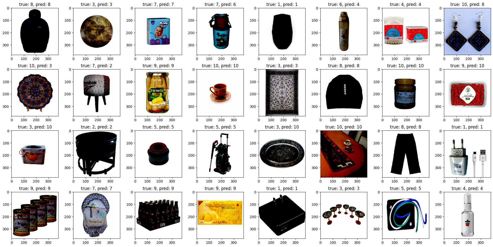

#### Model without L2


### Test and Save Results

#### Model with L2
32/32 [==============================] - 18s 550ms/step <br>
F1_micro: 0.7317317317317317
| Class | Precision | Recall | F1-Score | Support |
|-------|-----------|--------|----------|---------|
| 1     | 0.65      | 0.74   | 0.70     | 86      |
| 2     | 0.72      | 0.54   | 0.62     | 101     |
| 3     | 0.62      | 0.71   | 0.66     | 107     |
| 4     | 0.75      | 0.68   | 0.71     | 78      |
| 5     | 0.66      | 0.78   | 0.71     | 98      |
| 6     | 0.88      | 0.67   | 0.76     | 111     |
| 7     | 0.71      | 0.71   | 0.71     | 111     |
| 8     | 0.85      | 0.93   | 0.89     | 104     |
| 9     | 0.80      | 0.83   | 0.81     | 108     |
| 10    | 0.73      | 0.71   | 0.72     | 95      |
| Micro Avg | 0.73   | 0.73   | 0.73     | 999     |
| Macro Avg | 0.67   | 0.66   | 0.66     | 999     |
| Weighted Avg | 0.74| 0.73  | 0.73     | 999     |


#### Model without L2
32/32 [==============================] - 17s 528ms/step <br>
F1_micro: 0.7367367367367368
| Class | Precision | Recall | F1-Score | Support |
|-------|-----------|--------|----------|---------|
| 1     | 0.75      | 0.70   | 0.72     | 86      |
| 2     | 0.59      | 0.63   | 0.61     | 101     |
| 3     | 0.63      | 0.68   | 0.65     | 107     |
| 4     | 0.75      | 0.64   | 0.69     | 78      |
| 5     | 0.69      | 0.67   | 0.68     | 98      |
| 6     | 0.79      | 0.75   | 0.77     | 111     |
| 7     | 0.76      | 0.74   | 0.75     | 111     |
| 8     | 0.88      | 0.90   | 0.89     | 104     |
| 9     | 0.81      | 0.84   | 0.82     | 108     |
| 10    | 0.74      | 0.77   | 0.75     | 95      |
| Micro Avg | 0.74   | 0.74   | 0.74     | 999     |
| Macro Avg | 0.67   | 0.67   | 0.67     | 999     |
| Weighted Avg | 0.74| 0.74  | 0.74     | 999     |


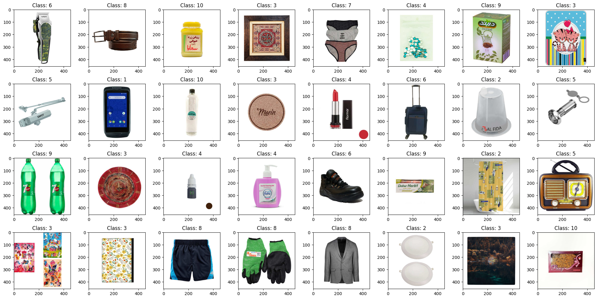


------------------------------------------------------------------------------------------------
# Problem 2: Sentiment Analysis


## Section 1

### 1. Distribution of overall
As we can see, the dataset is not balanced, for example, half of our data has an overall rating of 5. If the data used for modeling is not balanced, our model will be biased, which is undesirable. Therefore, for modeling, we need to select an approximately equal number of data from each category. This task is not performed in this section and will be done during modeling.

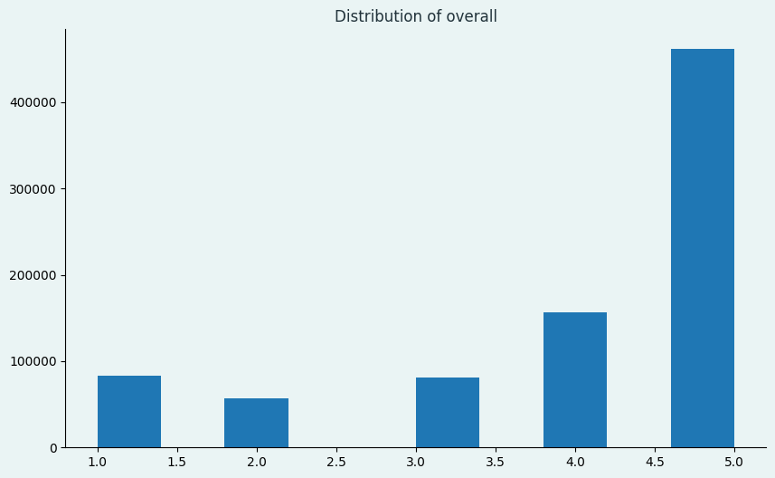

### 2. Word Clouds
Here, we first tokenize the reviews in each category and count the occurrences of each word. Then, we draw a word cloud based on the frequency of the words.

#### Word Cloud of reviews with overall rating 1 & 2
In the word cloud of negative reviews, positive words such as "good" and "great" may have been used along with a negative verb. The same observation can be made for words like "work" and "like" which also have a high frequency. Another frequently occurring word is "time" which could indicate dissatisfaction with the delivery time of the product. Additionally, there are other noticeable words that indicate dissatisfaction, such as "disappointed", "problem", "issue", "unfortunately", "return" and ...

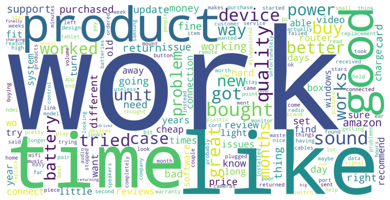

#### Word Cloud of reviews with overall rating 3
In the word cloud of neutral reviews, positive words like "good" and "great" have increased compared to the previous state. However, it is worth noting the high frequency of the word "sound" which is likely used in conjunction with positive words and indicates relative satisfaction with the product. The word "better" also has a high repetition, suggesting that individuals felt the product could have been better or that it was better compared to other products.

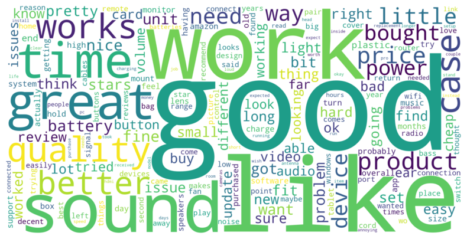

#### Word Cloud of reviews with overall rating 4 & 5
In the word cloud of positive reviews, positive words like "good" and "great" have shown a significant increase compared to previous states. Furthermore, the word "great" is the most frequently occurring word in this word cloud, indicating customer satisfaction with the products. There are also other words in this word cloud that represent customer satisfaction, such as "excellent", "perfectly", "recommend", "love", "pretty" and ...

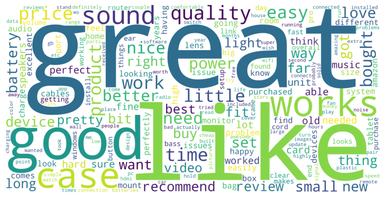

Here we have all three word clouds side by side.

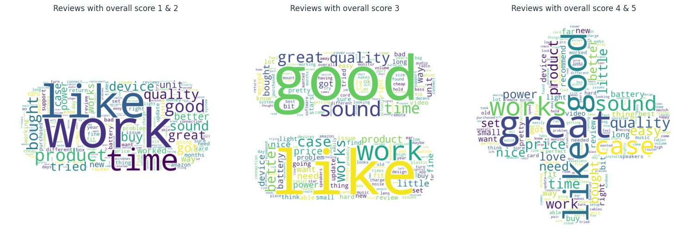

### Extra. Word Clouds of reviews summary

#### Word Cloud of summaries of reviews with overall rating 1 & 2
In the word cloud of negative reviews summary, we can observe a high frequency of negative words such as "bad", "poor", "junk", "waste" and "terrible". Additionally, words like "garbage", "horrible", "annoying", "worthless" and "disappointment" are used with lower frequency. The word "defective" also has a low repetition, indicating dissatisfaction of some customers with not receiving all the items they ordered.
Another interesting point is that the only frequently mentioned brand in these summaries is Samsung.

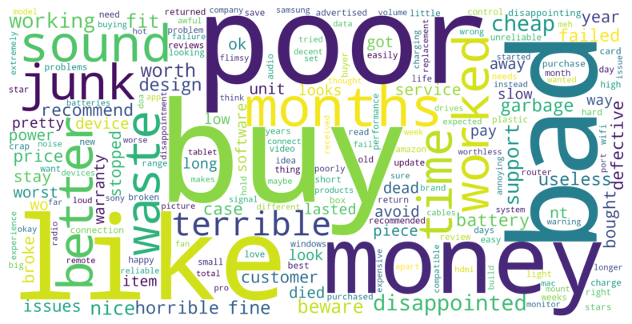

#### Word Cloud of summaries of reviews with overall rating 3
In the word cloud of neutral reviews summary, there is a higher frequency of positive words compared to negative words. Words like "nice", "fine", and "ok" are more frequently used. However, the word "bad" also has a high repetition.
The word "sound" is as expected, highly repeated, and can be associated with both positive and negative contexts, indicating a middle level of satisfaction or dissatisfaction in these reviews summary. The word "better" is also frequently mentioned, indicating lack of complete satisfaction from customers.
The word "cheap" is somewhat repeated, suggesting that affordability may contribute to moderate satisfaction among customers.

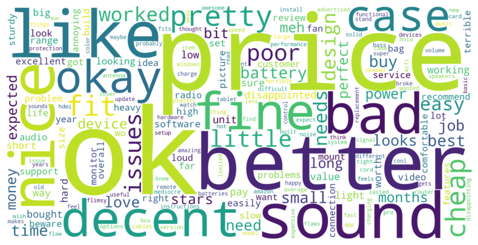

#### Word Cloud of summaries of reviews with overall rating 4 & 5
In the positive reviews's summary, there is a noticeable presence of positive words such as "nice", "perfect", "excellent", "best", "awesome", "fantastic", "love", "amazing", "happy" and ... indicating customer satisfaction with the products.
An important point is that the most frequently mentioned word here is "price" Therefore, we can conclude that the price factor is** highly significant in the opinions of customers**.

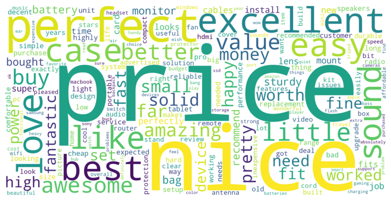

Here we have all three word clouds side by side.
The difference we have here compared to the previous state(the word clouds of reviews), is that the categories are significantly distinct from each other, and the differences are clearly visible.
From this, we can conclude that customers express their opinions more explicitly in the summary of reviews.

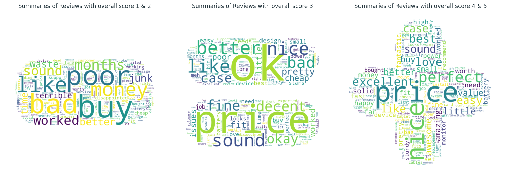

### 3. Top 10 person who had the most useful reviews

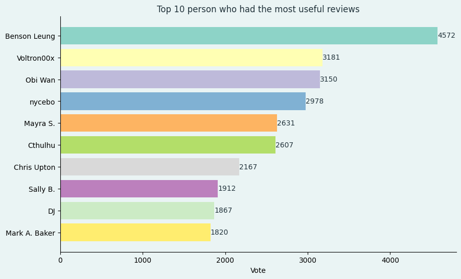

### 4. Review Text Length Distribution

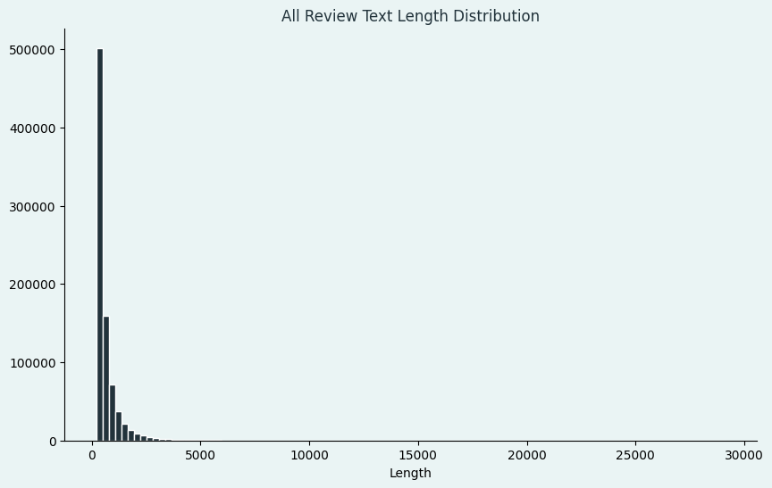

As observed, our dataset contains outliers. The reviews with a length of approximately more than 3000 have occurred very rarely.

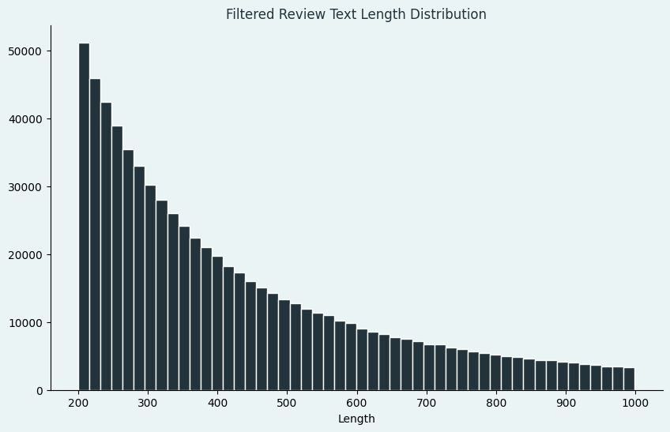

Here, we have plotted the distribution of reviews with a length of less than 1000, and as observed, there is a sufficient number of data in each category. The selection of the maximum reviews length for modeling is done in the modeling section.

### 5. Top 10 products that have achieved the highest number of overall ratings of 5.


### 6. Top 10 brands that had the highest number of reviews and the highest average overall rating.

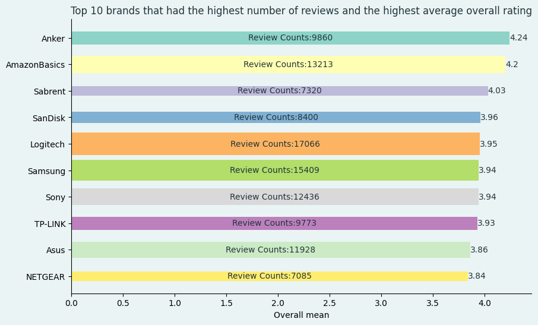


### Extra. Top 10 person who had the most not verified reviews

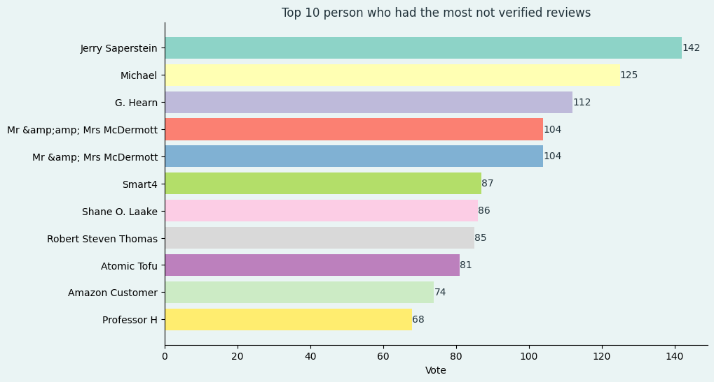

Let's examine the word clouds of comments from two individuals to see why their comments were not approved.


The word clouds of reviews from this individual did not include any unusual words. However, an important point is that the most frequently mentioned word in his reviews was his own name.
Additionally, single letters like N, T, X, M and S and two-letter words like "ve" and "wo" are observed. These letters and words indicate that this individual may have made mistakes in writing his reviews, which is why his reviews were not approved.

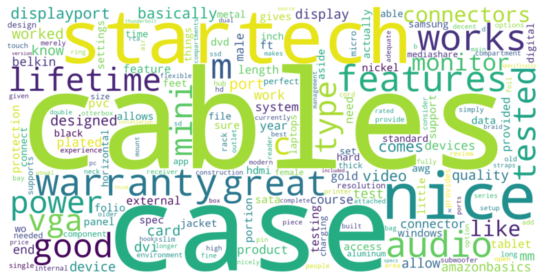

In the word cloud of the second individual's reviews, no unusual words were used as well. However, one notable inclusion among the most frequently mentioned words was the brand "StarTech" indicating that this person is either a strong supporter of this brand or has a strong dislike for it.
Similar to the previous case, single letters like M and X were among the repeated words. Therefore, this person also confirms the previous conclusion that their reviews were not approved likely due to spelling mistakes or errors in their writing.
### Extra. Positive, Neutral and Negative Reviews Length box plot

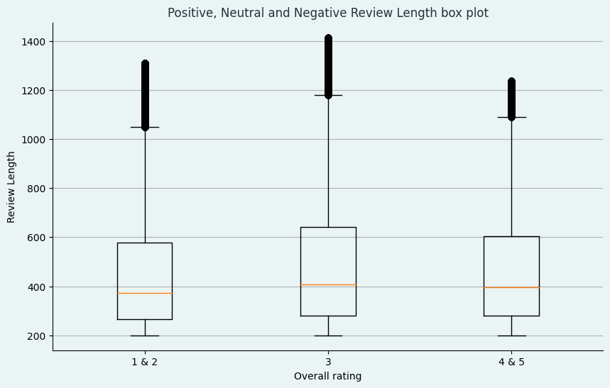

As we can observe, neutral comments generally have a slightly longer length. Therefore, we can say that when people are either satisfied or dissatisfied with something, they express their opinions in a shorter manner compared to a state where they have neither complete satisfaction nor complete dissatisfaction.

### Extra. Top 10 Colors that had the highest number of reviews and the highest average overall rating.

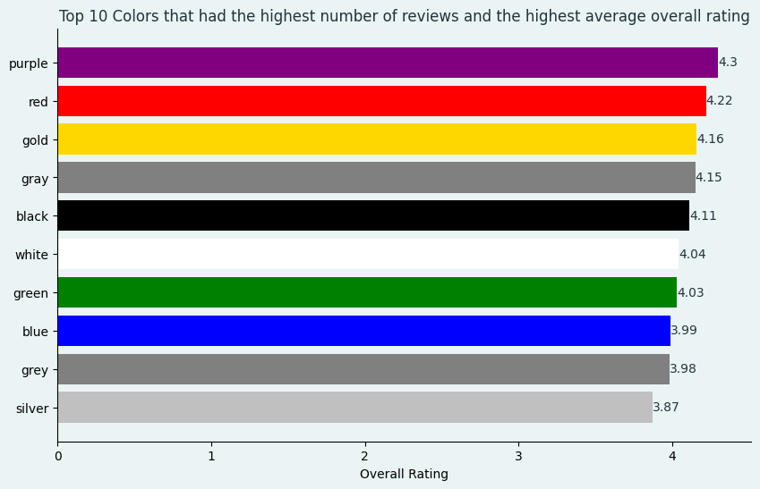

------------------------------------------------------------------------------------------------

## Section 2

### Preservation of semantic and syntactic relationships

Word embeddings are a way to represent words and whole sentences in a numerical manner. We know that computers understand the language of numbers, so we try to encode words in a sentence to numbers such that the computer can read it and process it. 
* [Word Embedding](https://www.tensorflow.org/text/guide/word_embeddings)

But reading and processing are not the only things that we want computers to do. We also want computers to build a relationship between each word in a sentence, or document with the other words in the same.

The word embedding approach is able to capture multiple different degrees of similarity between words. Mikolov et al. (2013) found that semantic and syntactic patterns can be reproduced using vector arithmetic. Patterns such as "Man is to Woman as Brother is to Sister" can be generated through algebraic operations on the vector representations of these words such that the vector representation of "Brother" - "Man" + "Woman" produces a result which is closest to the vector representation of "Sister" in the model. Such relationships can be generated for a range of semantic relations (such as Country–Capital) as well as syntactic relations (e.g. present tense–past tense).

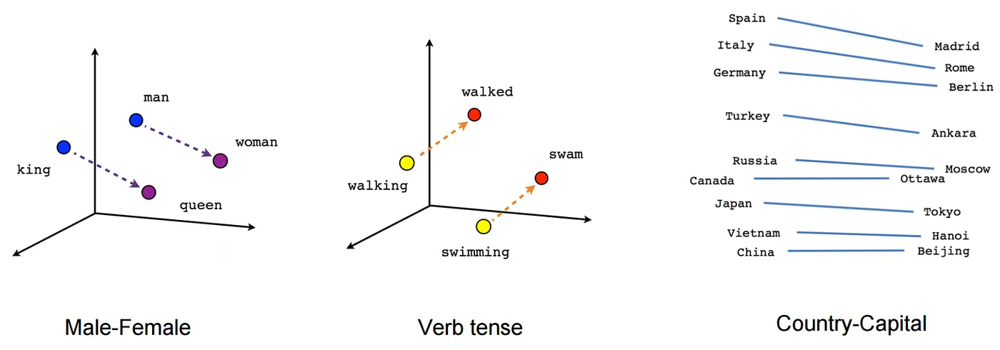

We want word embeddings to capture the context of the paragraph or previous sentences along with capturing the semantic and syntactic properties and similarities of the same. 
Word embedding is one of the most used techniques in natural language processing (NLP). Word Embedding is a language modeling technique used for mapping words to vectors of real numbers. It represents words or phrases in vector space with several dimensions.
* [Word Embedding](https://web.stanford.edu/~jurafsky/slp3/) 

Word2vec was created, patented, and published in 2013 by a team of researchers led by Mikolov at Google over two papers
* [Tomáš Mikolov 1](https://arxiv.org/abs/1301.3781) 
* [Tomáš Mikolov 2](https://arxiv.org/abs/1310.4546)

Word2Vec consists of models for generating word embedding. These models are shallow two-layer neural networks having one input layer, one hidden layer, and one output layer.

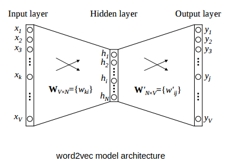

The basic idea of word embedding is words that occur in similar contexts tend to be closer to each other in vector space.


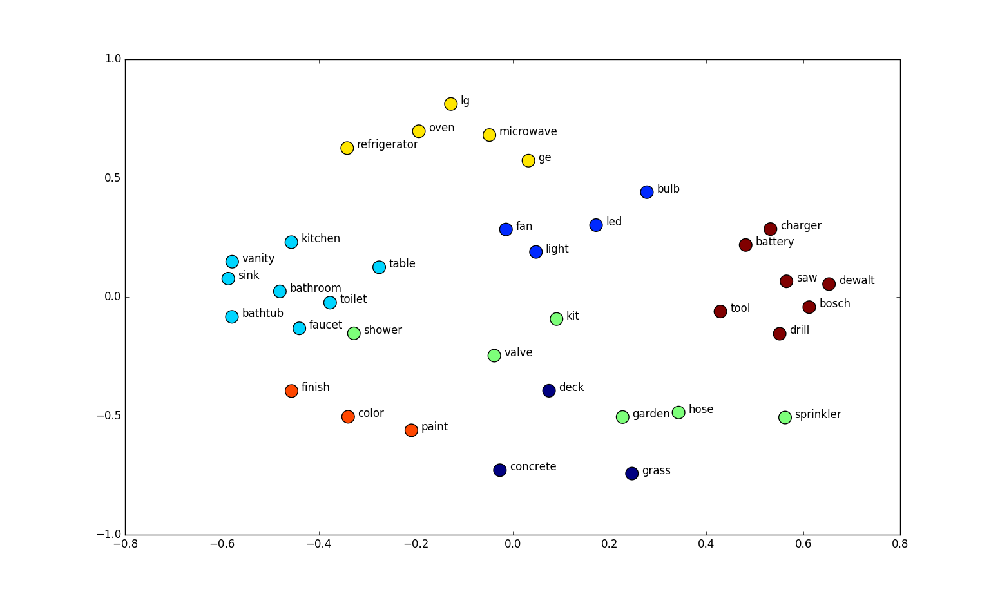

So in conclusion, Word2vec is a method to create word embeddings efficiently and has been around since 2013. Word2vec is a two-layer neural net that processes text by “vectorizing” words. Its input is a text corpus and its output is a set of vectors: feature vectors that represent words in that corpus.

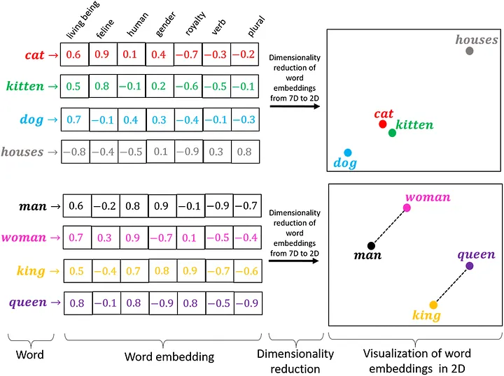


### Preprocessing

#### 1. Converting the review text into a long string:
first of all, concatenates all the review texts from the train dataset into a single string called raw_corpus.

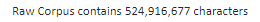

#### 2. Downloading and loading the punkt tokenizer:
now, uses the Natural Language Toolkit (NLTK) to download the punkt tokenizer, which is a pre-trained tokenizer for English.

#### 3. Tokenizing the raw corpus into sentences:
after that loads the tokenizer, now it's time to tokenize the raw corpus into sentences using the loaded punkt tokenizer. The resulting sentences are stored in the raw_sentences list, and the code prints the number of raw sentences.

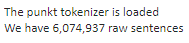

#### 4. Cleaning and splitting sentences into words:
This code defines a function called clean_and_split_str that removes special characters from a string and splits it into a list of words. It then applies this function to each raw sentence in raw_sentences and builds a list of cleaned sentences called sentences. The code prints the number of clean sentences.

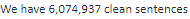

#### 5. Counting the number of tokens:
This code calculates the total number of tokens in the dataset corpus by summing the lengths of all sentences in sentences. It then prints the token count.

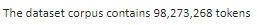

### Word2Vec

#### 6. Setting Word2Vec parameters:
This code sets various parameters for the Word2Vec model, such as the dimensionality of word vectors (num_features), minimum word count threshold (min_word_count), number of parallel workers (num_workers), context window length (context_size), and the seed for reproducibility (seed).

##### Google’s Word2vec Pretrained Word Embedding:
Word2Vec is one of the most popular pretrained word embeddings developed by Google. Word2Vec is trained on the Google News dataset (about 100 billion words). It has several use cases such as Recommendation Engines, Knowledge Discovery, and also applied in the different Text Classification problems.

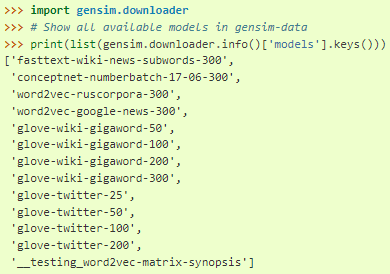

##### Notice :
We wanted to use the google-news-300 pre-train model to compare with the current model, but due to hardware limitations, we could not use it.

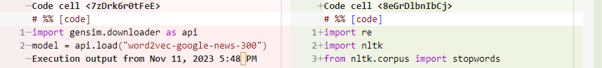

#### 7. Building the vocabulary:
This code initializes a Word2Vec model with the specified parameters and builds the vocabulary based on the sentence list.

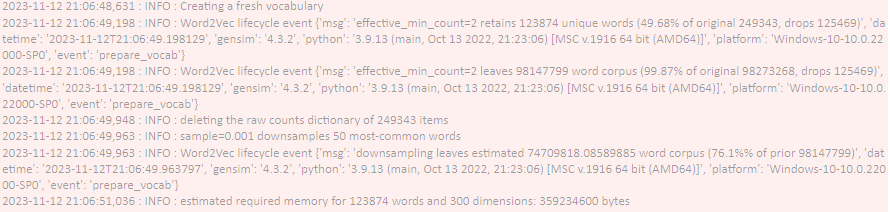
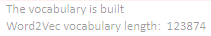

#### 8. Training the Word2Vec model:
This code trains the Word2Vec model on the sentence data for a specified number of epochs.

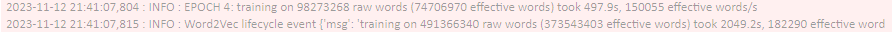

#### 9. Accessing word vectors:
This code demonstrates how to access word vectors for specific words like "guarantee" and "warranty" using the trained Word2Vec model.

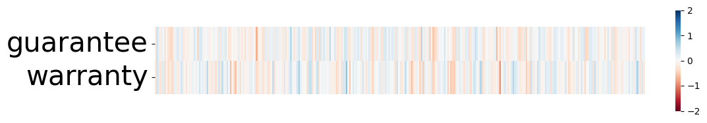

### Most similar words
#### 10. Finding similar words:
This code finds the most similar words to "guarantee" and "warranty" based on the trained Word2Vec model.

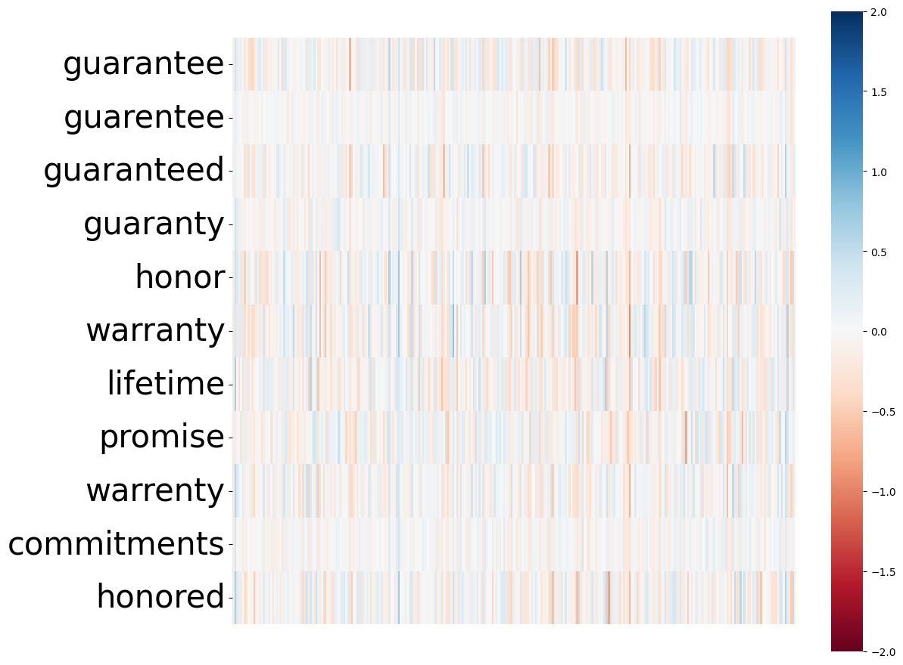
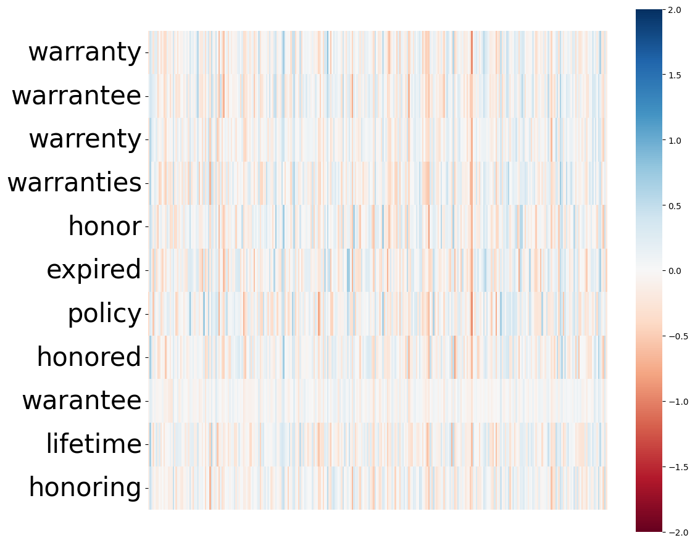

#### 11. Expanding the list of keywords:
This code combines the original keywords with similar words and removes duplicates to obtain an expanded list of keywords.

#### 12. Filtering reviews based on keywords:
This code filters the reviews in the train['reviewText'] dataset, keeping only the ones that contain at least one of the keywords or similar words. The filtered reviews are stored in the filtered_reviews list.

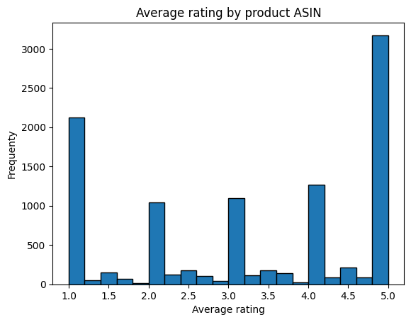

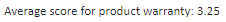

### Visualizing Word2Vec Word Embeddings using t-SNE

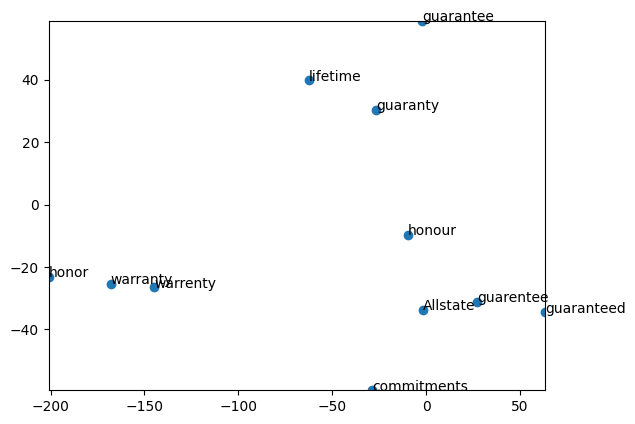
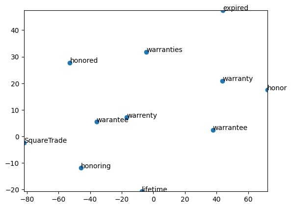

It is also possible to draw it on all the data (as in the figure below), but due to hardware limitations, we could not do this.

* [tsne word2vec all dataset](https://www.kaggle.com/code/bavalpreet26/word2vec-pretrained)

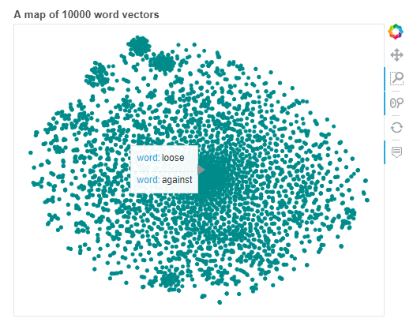

It is also possible to classify words in two-dimensional space to compare the vector representation relationships between a query word as in the example in the link below.

* [words classify example](https://www.kaggle.com/code/pierremegret/gensim-word2vec-tutorial) 

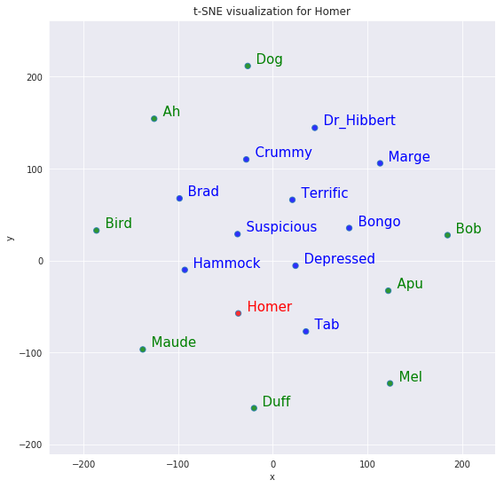

------------------------------------------------------------------------------------------------

## Section 3

### Text Cleaning

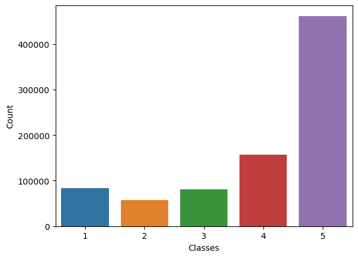

#### Drop reviewTexts where len(reviewText) > 600 and len(summary) < 100

### Sampling

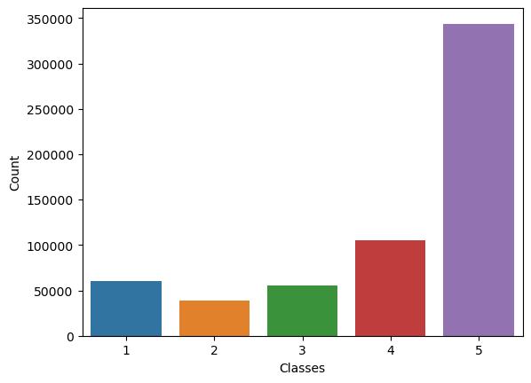
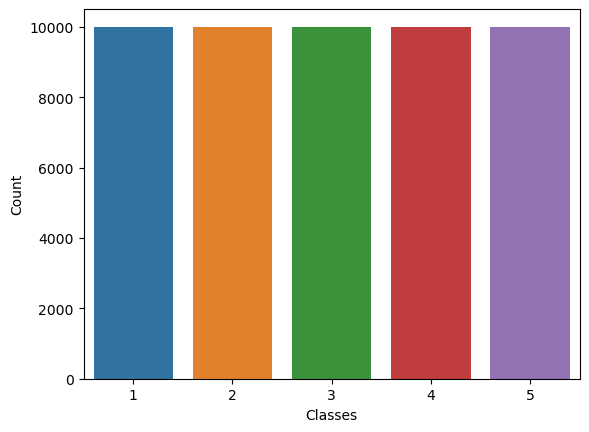

### Plot History

#### Model 1 (BERT):


#### Model 2 (Distil-BERT):

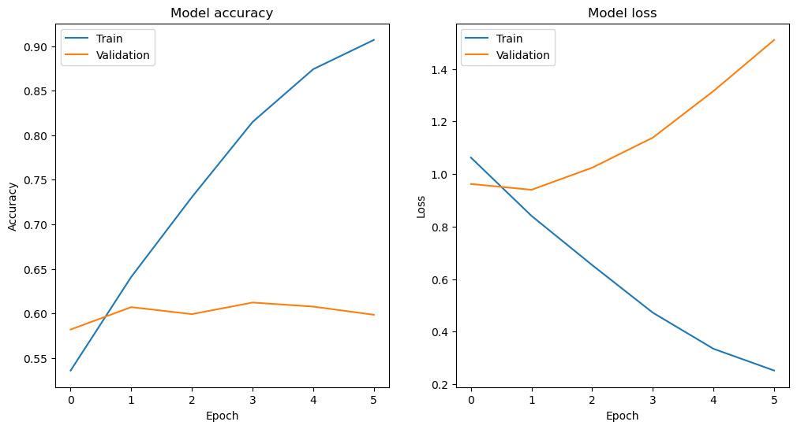

------------------------------------------------------------------------------------------------

## Section 4

### Text Cleaning


#### Drop reviewTexts where len(reviewText) > 600 and len(summary) < 100

### Sampling

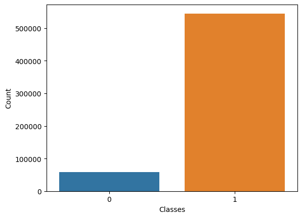
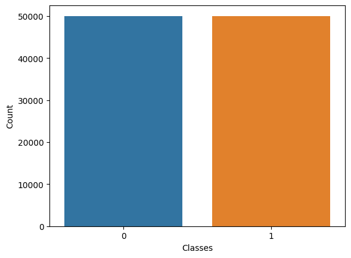
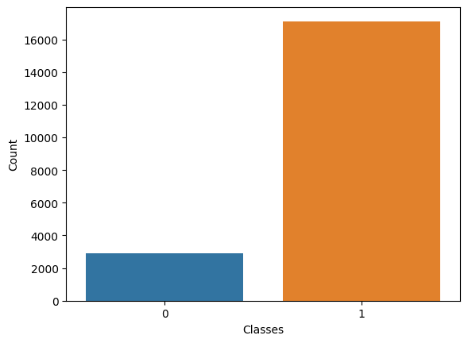


--------------------------------------------------------------------------------------------------
