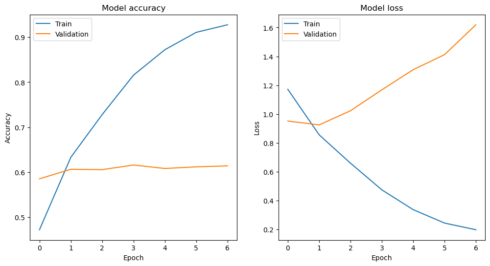

# Quera_G11-Project3
Deep Learning (Image Classification & Sentiment Analysis)

This repository is for the third internship project of [Quera Data Science Bootcamp](https://quera.org/college/bootcamp/data-science)

[Quera](https://quera.org/) Data Science Bootcamp has been held for 12 weeks from August to November 2023. in which we learned and practiced both technical and soft skills in order to become ready to work as data Scientists in the market and industry.

This repository is for the third teamwork internship project of this Bootcamp, which is about Image Classification and Sentiment Analysis in Deep Learning and Natural Language Processing.

The following members are present in this team, arranged in alphabetical order:
- (Group 11)
* [**Mr. Abednezhad, Saleh (Team Head)**](https://github.com/mr-robot77)
* [Mr. Ghiyasi, Mahdi](https://github.com/mahdi-ghiyasi)
* [Mr. Moosaei, Amirali](https://github.com/mo0o0o0os)

This team has completed the project under the mentoring of **Mr. Jour Ebrahimian, Hossein**.

--------------------------------------------------------------------------------------------------
##  Introduction

Welcome to the documentation for our project that involves importing data into Jupyter Notebook, performing  and  analysis on the collected data with , and finally visualizing it. This project aims to provide valuable insights into data, enabling us to make informed decisions and gain a deeper understanding of .

## Objectives

The primary objective of this project is to create a  data. By following this documentation, you will learn how to:

1. : analyzing data with  and getting insights.

2.  : analyzing data with .

3. : .


Below is a file structure of this project:

```
    .
    ├── Problem1-Image Classification    # Image Classification
    |    ├── image_product_classification.ipynb
    |
    ├── Problem2-Sentiment Analysis-NLP  # Sentiment Analysis
    |   ├── Sentiment_Analysis_Amazon_NLP_Q1.ipynb
    |   ├── Sentiment_Analysis_Amazon_NLP_Q2.ipynb
    |   ├── Sentiment_Analysis_Amazon_NLP_Q3.ipynb
    |   ├── Sentiment_Analysis_Amazon_NLP_Q4.ipynb
    |
    ├── images
    |
    ├── submission
    |
    ├── ERD_diagram.png   # Picture of ERD Diagram Schema
    |
    └── README.md # Explanation of project structure, tools used, and instructions for executing each part of the project.
```


--------------------------------------------------------------------------------------------------
### Problem 1: Image Classification

##### 


#### 


------------------------------------------------------------------------------------------------
### Problem 2: Sentiment Analysis


#### Section 1


#### Section 2


#### Section 3





#### Section 4


--------------------------------------------------------------------------------------------------
